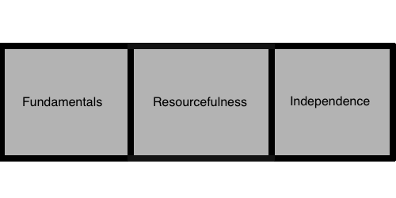

# Outline
## Curriculum

The following is brief attempt at a breakdown of the current curriculum of WDI.

### Stages

There are three main stages of the course

* Weeks 1-4
	* programming fundamentals
	* web application development
* Weeks 6-8
	* resourcefulness
		* review study skills
		* research skills
		* team skills
* Weeks 10-11
	* independence
    * interview preparation
		* advanced applications
		* project time
		
### Week By Week Breakdown

#### Terms 

* **SWBAT**: stands for "Students Will Be Able To."
* **Common Assessment**: a direct assessment used as a standard across instances of WDI running in parallel.
* **CS Core**: a technical minimum of problem solving abilities or techniques that should be demostrated by each student.

   * **Week 1**
       * **SWBAT**:
         * demonstrate basic command line familiarity
         * perform basic git and GitHub tasks
         * explain and manipulate DOM
         * develp basic javascript client applications
         * identify and employ course tools: package managers, etc
         * use CSS
       * **Common Assessment**:
           * [Tic-Tac-Toe: Vanilla JS](https://github.com/wdi-sf-july/tictactoe_js)
       * **CS Core**:
           * merge two sorted arrays
           * palindrome
   * **Week 2**
       * **SWBAT**:
	       * practice and implement iterator patterns
	       * examine and practice TDD
	           * Mocha with Chai assertions
	       * describe and apply higher order functions 
	       * prototypes and Klassical Inheritance
	       * develop using OOP and object relationships
       * **Common Assessment**:
           * [Apartment Lab](https://github.com/wdi-sf-july/apartment_lab)
       * **CS Core**:
           * fibonacci
           * merge-sort
           * big O notation
   * **Week 3**
       *  **SWBAT**:
	   	   * identify an Express application and its components
	   	   * implement a CRUD web application for a resource
	   	   * utilize middleware for an application
               * templating `ejs`
               * body-parser (body params)
               * method-override 
	       * describe and implement SQL Selections, Relationships, and JOINS
	       * describe and implement DB modeling (ORM) for a single table
       * **Common Assessment**:
           * [Implement ORM for a TABLE](https://github.com/wdi-sf-july/node_postgres_orm)
       * **CS Core**:
           * BinarySearch
   * **Week 4**:
       *  **SWBAT**:
	       * describe and utilize Sequelize and model relationships
	           * one-to-one, many-to-one, many-to-many
	       * describe and implement Authentication and Authorization
	       		* intro to bcrypt
	       * utilize auth tools: passport
	       * utilize Bootstrap
       * **Common Assessment**:
       		* None Working on Project 1
       * **CS Core**:
           * review
   * **Week 5** (little to no lecturing):
       * Review
       * Discuss Request Specs
       * Heroku Deployment
       * Project 1
       	 * Submissions:
       	 	* [Picture It Now](https://github.com/ranleung/picture_it_now)
       	 	* [Globe Tweet](https://github.com/cameronjacoby/globe_tweet)
   * **Week 6**:
       *  **SWBAT**:
       	   * compare and contrast Ruby and Javascript
	       * identify and use Ruby control flow and methods
	       * implement and describe classes and inheritance
	       * possible: Nokogiri Intro
	       * compare and contrast RSpec with Mocha-Chai testing
       * **Common Assessment**:
           * open ended client-side projects to encourage research and discovery
           * Submissions:
             * [Flux Clock](https://github.com/cameronjacoby/flux_clock)
             * [Birds Life](https://github.com/marklc44/birds-life)
             * [PhysBox](https://github.com/MooreJesseB/physbox)
             * [Springy](https://github.com/lisavogtsf/long_weekend_lab)
           
       * **CS Core**:
           * [Intro Linked List](https://github.com/wdi-sf-july/singly_linked_list_ruby)
       
   * Week 7:
       * Presentations
       * Intro Rails MVC
       * ActiveRecord Relationships 
       * Resources and Nested Resources
       * RSpec
           * Controller and Model specs
       * Project:
           * [Group Implementation of MicroBlog](https://github.com/wdi-sf-july/micro_blog)

       * CS:
           * [More Linked List](https://github.com/wdi-sf-july/singly_linked_list_ruby)
       
   * Week 8:
       * Presentations
       * Authentication
       * Mailers
       * AJAX JSON API 
       * Templating
   * Week 9
       * Heroku Deployment
       * Project 2 Group 
       * 
   * Week 10
       * Interview Prep
           * [Vocabularly Building](https://github.com/wdi-sf-july/WDI-vocab)
           * Doubly Linked List TDD
           * Binary Search Tree TDD
           * Trie TDD: Autocomplete Lab
       * Factory Girl
       * Controller Specs
           * Double, Mocks, and Stubs
       * SideKiq/Redis
       * Coffeescript
       * Intro Angular with Rails
           * views
           * controllers
           * modules
           * http
       * Project
           * [Hangman](https://github.com/wdi-sf-july/final_weekend_lab)
           * Submission:
           	 * [Hangman](http://jsbin.com/pulutimuwaxo/1/edit)
   * Week 11:
       * Datastructure Review
       * Mock Interviews
       * More Angular:
           * angular modules
           * Router
           * services
               * services, factories, providers
           * resources
           * custom directives
      
  * Week 12:
  	* Final Project
  	
### Curriculum Questions?

* Want to find more resources associated with this curriculum?
	* Check out the [Repo](https://github.com/Curriculum-Resources/SF-14-Class-10-Notes)